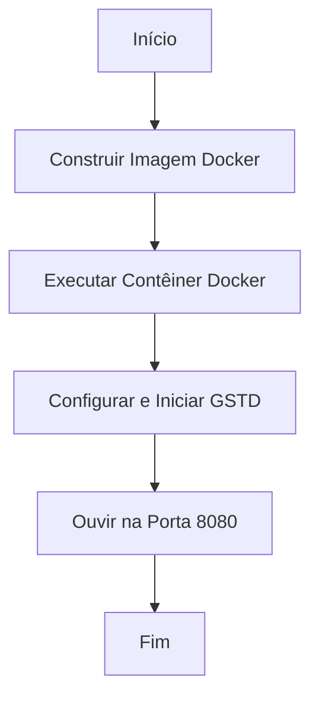

# GSTD Runner


## Introdução

Este projeto configura um contêiner Docker baseado no Ubuntu 22.04 que instala e configura o GSTD (GStreamer Daemon) e o plugin gst-interpipe da RidgeRun. A imagem resultante permite executar o GSTD com suporte ao protocolo HTTP, ouvindo na porta 8080.

## Instruções de Uso

1. **Construção da Imagem Docker**: Para construir a imagem Docker, execute o seguinte comando na raiz do seu projeto:
    ```sh
    docker build -t gstd-runner .
    ```

2. **Execução do Contêiner**: Para executar o contêiner, utilize o comando abaixo:
    ```sh
    docker run -p 8080:8080 gstd-runner
    ```

3. **Acesso ao GSTD**: O GSTD estará disponível através do endereço `http://localhost:8080`.

## Diagrama de Fluxo



## Estrutura do Projeto

- `/app`: Diretório de trabalho dentro do contêiner.
- `/app/gstd-1.x`: Diretório temporário para clonar e construir o GSTD.
- `/app/gst-interpipe`: Diretório temporário para clonar e construir o plugin gst-interpipe.
- `/app/recording`: Diretório criado para armazenar gravações (se necessário).

## Dependências Instaladas

- `sudo`
- `git`
- `tzdata`
- `dumb-init`
- `curl`
- `iputils-ping`
- `automake`
- `libtool`
- `pkg-config`
- `libgstreamer1.0-dev`
- `libgstreamer-plugins-base1.0-dev`
- `libglib2.0-dev`
- `libjson-glib-dev`
- `gtk-doc-tools`
- `libreadline-dev`
- `libncursesw5-dev`
- `libdaemon-dev`
- `libjansson-dev`
- `libsoup2.4-dev`
- `libedit-dev`
- `python3-pip`
- `gstreamer1.0-plugins-base`
- `gstreamer1.0-plugins-good`
- `gstreamer1.0-plugins-bad`
- `gstreamer1.0-plugins-ugly`
- `gstreamer1.0-libav`
- `gstreamer1.0-tools`
- `gstreamer1.0-x`
- `gstreamer1.0-alsa`
- `gstreamer1.0-gl`
- `gstreamer1.0-gtk3`
- `gstreamer1.0-qt5`
- `gstreamer1.0-pulseaudio`
- `gstreamer1.0-vaapi`

## Contribuição

Sinta-se à vontade para contribuir com este projeto. Para isso, siga as etapas abaixo:

1. Faça um fork do repositório.
2. Crie um branch para a sua feature (`git checkout -b feature/nova-feature`).
3. Comite suas alterações (`git commit -am 'Adiciona nova feature'`).
4. Faça push para o branch (`git push origin feature/nova-feature`).
5. Crie um novo Pull Request.

## Licença

Este projeto está licenciado sob a licença MIT - veja o arquivo [LICENSE](LICENSE) para mais detalhes.
